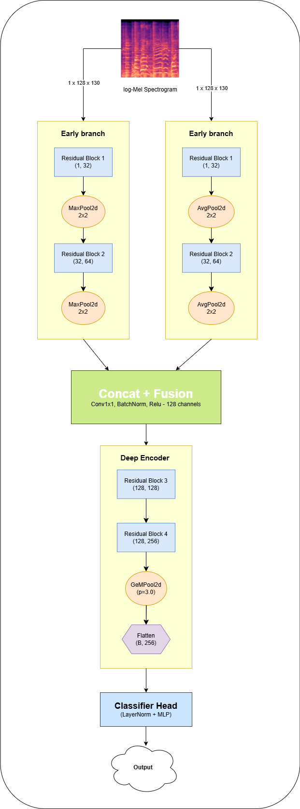

# TPS : Triple Pooling Strategy in Residual Network for Music Genre Classification

Music Genre Classification from audio signals is a vital task in music information retrieval, as it provides a compact semantic representation that supports better
understanding in audio and multimedia analysis. Many recent approaches rely on deep and computationally intensive architectures to achieve high performance, but
simple methods can still achieve good result. In this paper, we propose a novel architecture for efficient feature extraction, leveraging a triple-pooling strategy
(TPS) and residual blocks on log-Mel spectrograms. Each pooling layer is designed to capture complementary statistical characteristics from feature maps in different
ways, which are then fused to obtain a comprehensive representation. Meanwhile, residual connections help stabilize feature propagation during the training process.
Experimental results show that the effectiveness of our proposed TPS architect, which achieves 90.4\% accuracy on the GTZAN dataset and 83.08\% on a self-collected
dataset. This indicates that the hybrid pooling mechanism and residual architecture are not only able to provide strong performance but also maintain an efficient
model design.

Our custom dataset is publicly available at : https://www.kaggle.com/datasets/giaphatnguyen/museset

